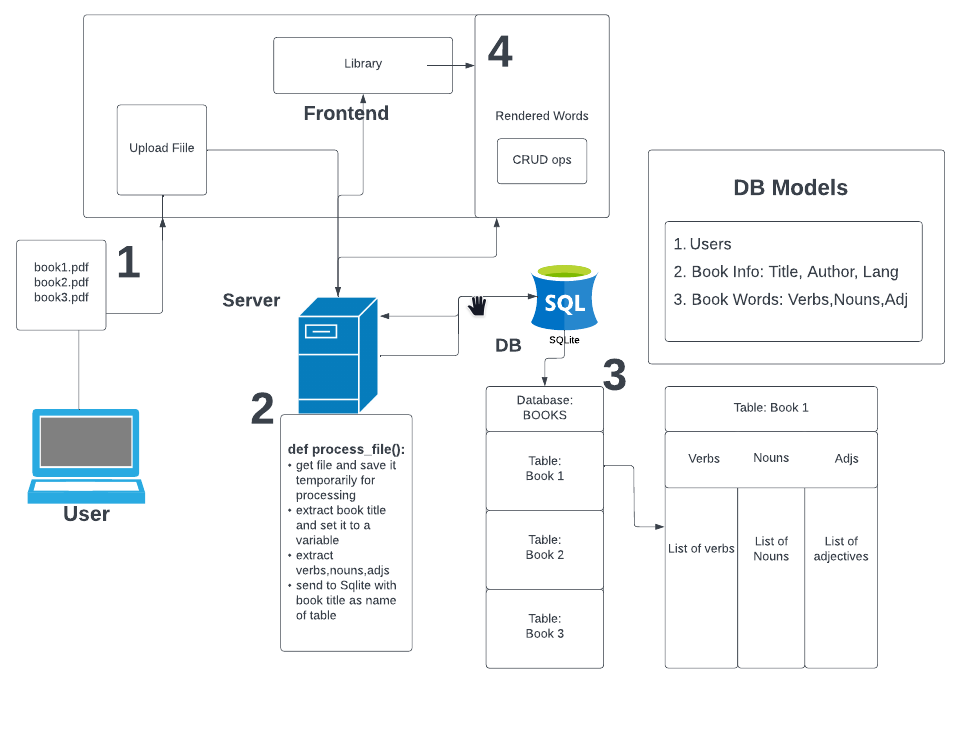

# MAGNUS

## Project in progress:   
web application that allows users to upload entire books to be parsed and auto-generate a study deck. Uses Natural Language processing to extract verbs, nouns, and adjectives and send to the database for future CRUD operations

Supports more than 10 languages

Whenever working with a fullstack application, I always like to break down my thinking process and create diagrams

